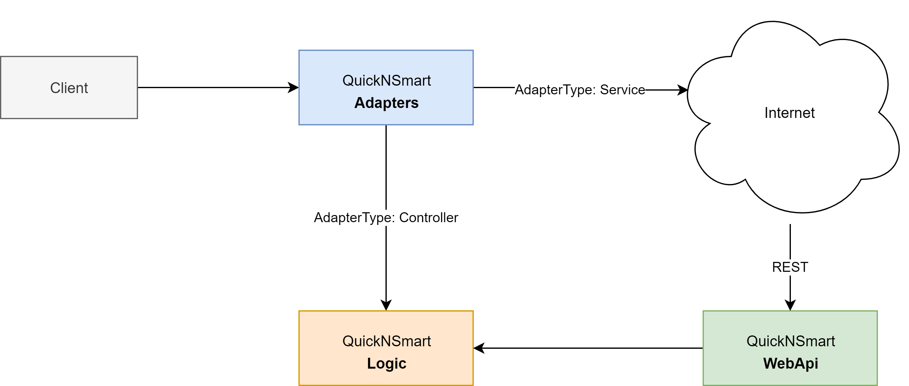
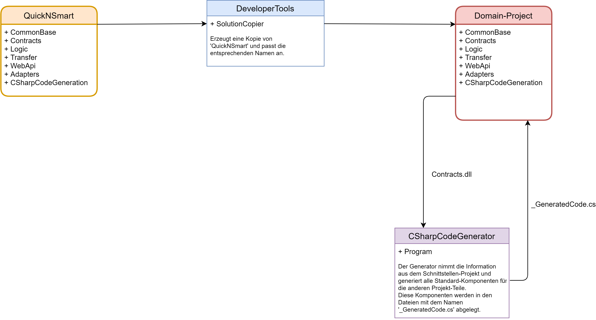

# QuickNSmart

Das Projekt 'QuickNSmart' ist ein kleiner Framework für die Erstellung von datenzentrierten Anwendungen. Ausgehen von diesem System können neue Anwendungen erstellt und erweitert werden. Der Framework unterstützt die Entwicklung einfacher Service-Anwendungen als auch die Erstellung von großen System-Anwendungen. Bei der Herstellung solcher Systeme wird der Entwickler von einem Code-Generator unterstützt. Details zur Arbitsweise des Generators folgen in den nächste Kapiteln.  
Die Struktur des Frameworks besteht aus folgende Komponeneten:

|Projekt|Beschreibung|Typ|Abhängigkeit
|---|---|---|---|
|**CommonBase**|In dieser Projekt werden alle Hilfsfunktionen und allgemeine Erweiterungen zusammengefasst. Diese sind unabhängig vom Problembereich und können auch in andere Domän-Projekte verwendet werden.|Library|keine
|**QuickNSmart.Contracts**|In dieser Projekt werden alle für das System notwendigen Schnittstellen und Enumerationen implementiert.|Library|keine
|**QuickNSmart.Logic**|Dieser Projekt beinhaltet den vollständigen Datenzugriff, die gesamte Geschäftslogik und stellt somit den zentralen Baustein des Systems dar. |Library|CommonBase, QuickNSmart.Contracts
|**QuickNSmart.Transfer**|Dieser Projekt beinhaltet die Transferobjekte für den Datenaustausch zwischen den einzelnen Schichten. |Library|CommonBase, QuickNSmart.Contracts
|**QuickNSmart.WebApi**|In diesem Projekt ist die REST-Schnittstelle implementiert. Diese Modul stellt eine API (Aplication Programming Interface) für den Zugriff auf das System über das Netzwerk zur Verfügung.|Host|CommonBase, QuickNSmart.Contracts, QuickNSmart.Logic
|**QuickNSmart.Adapters**|In diesem Projekt ist der Zugriff auf die Logik abstrahiert. Das bedeutet, dass der Zugriff auf die Geschäftslogik direkt oder über die REST-Schnittstelle erfolgen kann. Für dieses Modul ist die Schnittstelle 'IAdapterAccess\<T\>' im Schnittstellen-Projekt implementiert.|Host|CommonBase, QuickNSmart.Contracts, QuickNSmart.Logic, QuickNSmart.Transfer
|**QuickNSmart.ConApp**|Dieses Projekt ist eine einfache Test-Anwendung zum Kopieren und Ausgeben der Daten. |Console|QuickNSmart.Contracts, QuickNSmart.Logic
|**CSharpCodeGenerator.ConApp**|In diesem Projekt ist die Code-Generierung implementiert. Für alle System-Komponenten werden Standard-Komponenten generieriert. Diese Standard-Komponenten werden als 'partial'-Klasse generiert und können somit durch überschreiben von Eigenschaften und/oder Methoden bzw. durch das Schreiben von 'partial'-Methoden angepasst werden. Als Eingabe für den Generator dient das Schnittstellen-Projekt. Aus den Schnittstellen werden alle Informationen für die Generierung ermittelt. Der Generator wird automatisch bei einer Änderung der Schnittstellen ausgeführt.|Console|CommonBase
|**QuickNSmart.AspMvc**|Diese Projekt beinhaltet die Basisfunktionen für eine Web-Anwendung und kann als Vorlage für die Entwicklung einer einer Web-Anwendung mit dem QuickNSmart Framework verwendet werden.|Host|CommonBase, QuickNSmart.Contracts, QuickNSmart.Adapter
|**QuickNSmart.XxxYyy**|Es folgen noch weitere Vorlagen von Client-Anwendungen wie Angular, Blazor und mobile Apps. Zum jetzigen Zeitpunkt existiert nur die AspMvc-Anwendung. Die Erstellung und Beschreibung der anderen Client-Anwendungen erfolgt zu einem späteren Zeitpunk.|Host|CommonBase, QuickNSmart.Contracts, QuickNSmart.Adapter

## Projekt

Zur Umsetzung des Projektes wird DotNetCore (3.1) als Framework, die Programmiersprache CSharp (C#) und die Entwicklungsumgebung Visual Studio 2019 Community verwendet. Alle Komponenten können kostenlos aus dem Internet heruntergeladen werden.

## Kommunikation der Layer

Die Client-Anwendung interagiert mit dem Backend-System über den Adapters Layer. Der Client kann diesen Layer so konfigurieren, dass der Zugriff auf die Logik direkt oder indirekt über einen REST-Service erfolgt. Der Vorteil eines direkten Zugriffs liegt in der geringeren Datenübertragung zwischen der Logik und dem Client. Nachteilig ist allerdings, dass der Client und das Backend-System am gleichen Gerät ausgeführt werden müssen. Die nachfolgende Abbildung zeigt den Kommunikations-Pfad zwischen den einzelnen Ebenen.  



Die Konfiguration des Zugriffs auf das Backend-System kann über die Factory-Klasse des Layers Adapters gesteuert werden:

````csharp
// Access via the service (indirect).
Adapters.Factory.BaseUri = "https://localhost:5001/api";
Adapters.Factory.Adapter = Adapters.AdapterType.Service;
````

Oder

````csharp
// Access via the controller (direct).
Adapters.Factory.Adapter = Adapters.AdapterType.Controller;
````

Der Zugriff über den Service erfordert natürlich die Angabe der Adresse vom REST-Service. Die Angabe der Web-Adresse ist für den direkten Zugriff nicht von Bedeutung.

## System-Erstellungs-Prozess

### Übersicht  



Als Ausgangsbasis wird der Framework 'QuickNSmart' verwendet. Diese Projekt wird mit Hilfe dem Hilfsprogramm 'SolutionCopier' in ein Verzeichnis nach eigener Wahl kopiert. In diesem Verzeichnis werden alle Projektteile vom Framework kopiert und die Namen der Projekte werden entsprechend angepasst. Alle Projekte mit einem domainspezifischen Namen werden durch den Namen des Verzeichnisses ersetzt.  

Zum Beispiel soll ein Projekt mit dem Namen 'QnSTravelCount' erstellt werden. Im 'SolutionCopier' werden folgende Parameter eingestellt:  

````csharp
string sourcePath = @"BasePath\QuickNSmart";     // Verzeichnis - Framework-QuickNSmart
string targetPath = @"BasePath\QnSTravelCount";  // Verzeichnis - Domain-Project

var sc = new SolutionCopier();

sc.Copy(sourcePath, targetPath);
````

**Hinweis:** Beide Projekte müssen im gleichen Verzeichnis gespeichert (*BasePath*) sein.  

Nach dem Ausführen vom SolutionCopier (*sc.Copy(sourcePath, targetPath)*) befindet sich folgende Verzeichnisstruktur in **...\QnSTravelCount**:  

- CommonBase
- CSharpCodeGenerator.ConApp
- QnSTravelCount.Contracts
- QnSTravelCount.Logic
- QnSTravelCount.Transfer
- QnSTravelCount.WebApi
- QnSTravelCount.Adapters
- QnSTravelCount.ConApp
- QnSTravelCount.AspMvc

Im Projekt 'QuickNSmart' sind alle Code-Teile, welche als Basis-Code in andere Projekte verwendet werden können, mit einem Label '//@QnSBaseCode' markiert. Dieser Label wird im Zielprojekt mit dem Label '//@QnSCodeCopy' ersetzt. Das hat den Vorteil, dass Änderungen im Framework auf die bereits bestehenden Projekte übertragen werden können (nähere Informationen dazu gibt es später).  

### Anpassen des Projektes  

Nach dem Erzeugen des 'Projektes' werden die Schnittstellen im Schnittstellen-Projekt definiert und das Projekt erstellt. Beim Erstellen wird zuerst das Schnittstellen-Projekt Kompiliert und nach deren Übersetzung wird der CSharpCodeGenerator.ConApp ausgeführt. Diese Ausführung wird mit dem Build-Event im Schnittstellen Projekt aktiviert. Das Ausführen des Code-Generator kann natürlich auch jederzeit manuell erfolgen.  

Beim Ausführen des Generators werden die Komponenten der Reihe nach generiert:  

- Generierung der Entities im Logik-Projekt  
- Generierung des DataContext im Logik-Projekt  
- Generierung der Kontroller-Klassen im Logik-Projekt
- Generierung der Fabrik-Klasse im Logik-Projekt
- Generierung der Transfer-Klassen im Tranfer-Projekt
- Generierung der Kontroller-Klassen im WebApi-Projekt
- Generierung der Fabrik-Klasse im Adapter-Projekt

Die generierten Komponenten werden in den Dateien mit dem Namen '_GeneratedCode.cs' in den jeweiligen Modulen abgelegt. Diese Dateien werden nach jeder Änderung neu erzeugt und dürfen auf keinem Fall vom Entwickler angepassten Code enthalten. Detailes zum Anpassen des Domain-Projektes finden sich im Beispiel [QnSTravelCount](https://github.com/leoggehrer/QnSTravelCount).  

### Synchronisieren vom Framework (QuickNSmart) mit den Domain-Projekten  

In der Software-Entwicklung gibt es immer wieder Verbesserungen und Erweiterungen. Das betrifft den Framework 'QuickNSmart' genauso wie alle anderen Projekte. Nun stellt sich die Frage: Wie können Verbesserungen und/oder Erweiterungen vom Framework auf die Domain-Projekte übertragen werden? Im Framework sind die Quellcode-Dateien mit Labels (@QnSBaseCode) gekennzeichnet. Beim Kopieren werden diese Labels durch den Label (@CodeCopy) ersetzt. Mit dem Hilfsprogramm BaseCodeCopier werden die Dateien mit dem Label '@QnSBaseCode' und '@CodeCopy' abgeglichen. In der folgenden Skizze ist dieser Prozess dargestellt:


Die Einstellungen für den Abgleichprozess müssen wie folgt definiert werden:

```csharp
// Quell-Project: QuickNSmart
var sourcePath = Path.Combine(HomePath, "Google Drive", "Schule", "CSharp", "QuickNSmart", "Solution", "QuickNSmart");
var targetPaths = new string[]
{
    // Ziel-Projekt: QnSTravelCount
    Path.Combine(HomePath, "Google Drive", "Schule", "CSharp", "QnSTravelCount", "Solution", "QnSTravelCount"),
};
Paths.Add(sourcePath, targetPaths);
// Abgleich aller Dateien mit dem Label QnSBaseCodeLabel
SourceLabels.Add(sourcePath, new string[] { QnSBaseCodeLabel });  

```

Des Programm 'BaseCodeCopier.ConApp' muss manuell gestartet werden damit der Abgleich-Prozess aktiviert wird. Sollen Dateien vom Abgleich-Prozess ausgenommen werden, dann können die Labels (@CodeCopy) in den einzelnen Dateien im Ziel-Projekt entfernt werden.  

## Code-Generierungs-Prozess  

In der obigen Abbildung ist der Code-Generierungs-Prozess schemenhaft dargestellt. Der Code-Generator bekommt als Eingabe-Information die 'Domain-Projekt.Contracts.dll' und der Generator generiert aufgrund dieser Informationen die einzelnen Komponenten und letgt diese in den enstprechenden Teil-Projekten ab. Dieser Prozess wird automatisch ausgeführt, wenn eine Änderung im Schnittstellen-Projekt durchgeführt wurde. Der Prozess kann natürlich auch manuell akiviert werden. In beiden Fällen wird der gesamte generierte Code wieder vollständig erzeugt.  

Wie bereits erwähnt, werden bei der Code-Generierung viele Komponenten vom System erzeugt. Diese Komponenten werden in den Dateien '_GeneratedCode.cs' abgelegt und können vom Programmierer abgeändert werden. Allerdings dürfen keine Änderungen in der '_GeneratedCode.cs' direkt durchgeführt werden - der Grund ist - diese Dateien werden nach jeder Schnittstellen-Änderung automatisch erzeugt und die darin enthaltenen Änderungen gehen verloren. Im Nachfolgenden Abschnitt werden die einzelenen Komponenten detailiert erläutert.

### Entities  

Die Entities werden vom Generator vollständig erzeugt und Ergänzungen vom Programmierer sind nicht erforderlich. Der Generator erzeugt die Entities in folgenden Schritten:

1. Erzeugen der Definition - Entität
```csharp
partial class Travel : QnSTravelCount.Contracts.Persistence.App.ITravel
{
```
2. Erzeugen des **Klassen-Konstruktors** und die 'partial'-Methoden
```csharp
	static Travel()
	{
		ClassConstructing();
		ClassConstructed();
	}
	static partial void ClassConstructing();
	static partial void ClassConstructed();
```
3. Erzeugen des **Konstruktors** und die 'partial'-Methoden
```csharp
	public Travel()
	{
		Constructing();
		Constructed();
	}
	partial void Constructing();
	partial void Constructed();
```
4. Erzeugen der **Eigenschaften**
```csharp
	public System.String Designation
	{
		get
		{
			OnDesignationReading();
			return _designation;
		}
		set
		{
			bool handled = false;
			OnDesignationChanging(ref handled, ref _designation);
			if (handled == false)
			{
				this._designation = value;
			}
			OnDesignationChanged();
		}
	}
	private System.String _designation;
	partial void OnDesignationReading();
	partial void OnDesignationChanging(ref bool handled, ref System.String _designation);
	partial void OnDesignationChanged();
```
5. Erzeugen der **CopyProperties**-Methode
```csharp
	public void CopyProperties(QnSTravelCount.Contracts.Persistence.App.ITravel other)
	{
		if (other == null)
		{
			throw new System.ArgumentNullException(nameof(other));
		}
		bool handled = false;
		BeforeCopyProperties(other, ref handled);
		if (handled == false)
		{
			Id = other.Id;
			Timestamp = other.Timestamp;
			Designation = other.Designation;
		}
		AfterCopyProperties(other);
	}
	partial void BeforeCopyProperties(QnSTravelCount.Contracts.Persistence.App.ITravel other, ref bool handled);
	partial void AfterCopyProperties(QnSTravelCount.Contracts.Persistence.App.ITravel other);
```
6. Erzeugen der **Equals**-Methode
```csharp
	public override bool Equals(object obj)
	{
		if (!(obj is QnSTravelCount.Contracts.Persistence.App.ITravel instance))
		{
			return false;
		}
		return base.Equals(instance) && Equals(instance);
	}
	protected bool Equals(QnSTravelCount.Contracts.Persistence.App.ITravel other)
	{
		if (other == null)
		{
			return false;
		}
		return Id == other.Id && IsEqualsWith(Timestamp, other.Timestamp) && IsEqualsWith(Designation, other.Designation);
	}
```
7. Erzeugen der **GetHashCode()**-Methode
```csharp
	public override int GetHashCode()
	{
		return HashCode.Combine(Id, Timestamp, Designation);
	}
}
```
8. Erzeugen der Ableitung
```csharp
partial class Travel : IdentityObject
{
}
```
9. Erzeugen der Navigation-Eigenschaften
```csharp
partial class Travel
{
	public System.Collections.Generic.ICollection<QnSTravelCount.Logic.Entities.Persistence.App.Expense> Expenses
	{
		get;
		set;
	}
}
```


**Viel Spaß beim Testen!**
