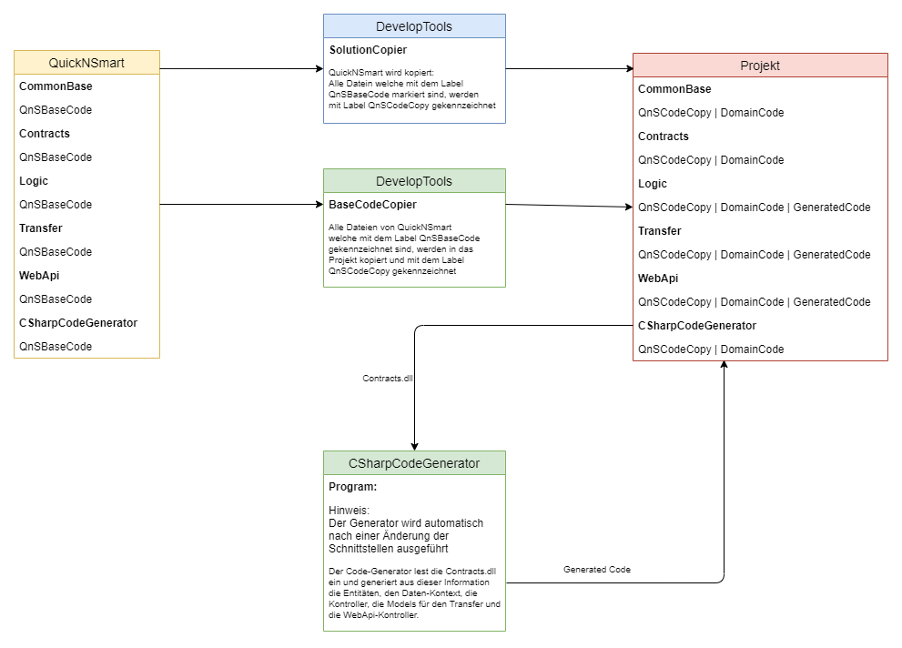

# QuickNSmart (Teil A)

Das Projekt 'QuickNSmart' ist ein kleiner Framework für die Erstellung von datenzentrierten Anwendungen. Ausgehen von diesem System können neue Anwendungen erstellt und erweitert werden. Die Struktur des Frameworks besteht aus folgende Komponeneten:

|Projekt|Beschreibung|Typ|Abhängigkeit
|---|---|---|---|
|**CommonBase**|In dieser Projekt werden alle Hilfsfunktionen und allgemeine Erweiterungen zusammengefasst. Diese sind unabhängig vom Problembereich und können auch in andere Domän-Projekte verwendet werden.|Library|keine
|**QuickNSmart.Contracts**|In dieser Projekt werden alle für das System notwendigen Schnittstellen und Enumerationen umgesetzt.|Library|keine
|**QuickNSmart.Logic**|Dieser Projekt beinhaltet den vollständigen Datenzugriff, die gesamte Geschäftslogik und stellt somit den zentralen Baustein des Systems dar. |Library|CommonBase, QuickNSmart.Contracts
|**QuickNSmart.Transfer**|Dieser Projekt beinhaltet die Transferobjekte für den Datenaustausch zwischen den einzelnen Schichten. |Library|CommonBase, QuickNSmart.Contracts
|**QuickNSmart.WebApi**|In diesem Projekt ist die REST-Schnittstelle implementiert. Diese Modul stellt eine API (Aplication Programming Interface) für den Zugriff auf das System über das Netzwerk zur verfügung.|Host|CommonBase, QuickNSmart.Contracts, QuickNSmart.Logic
|**QuickNSmart.Adapters**|In diesem Projekt ist der Zugriff auf die Logik abstrahiert. Das bedeutet, dass der Zugriff auf die Geschäftslogik direkt oder über die REST-Schnittstelle erfolgen kann. Für dieses Modul ist die Schnittstelle 'IAdapterAccess\<T\>' im Schnittstellen-Projekt implementiert.|Host|CommonBase, QuickNSmart.Contracts, QuickNSmart.Logic, QuickNSmart.Transfer
|**QuickNSmart.ConApp**|Dieses Projekt ist eine einfache Test-Anwendung zum Kopieren und Ausgeben der Daten. |Console|QuickNSmart.Contracts, QuickNSmart.Logic
|**CSharpCodeGenerator.ConApp**|In diesem Projekt ist die Code-Generierung implementiert. Für alle System-Komponenten werden Standard-Komponenten generieriert. Diese Standard-Komponenten werden als 'partial'-Klasse generiert und können somit durch überschreiben von Eigenschaften und/oder Methoden bzw. durch das Schreiben von 'partial'-Methoden angepasst werden. Als Eingabe für den Generator dient das Schnittstellen-Projekt. Aus den Schnittstellen werden alle Informationen für die Generierung ermittelt. Der Generator wird automatisch bei einer Änderung der Schnittstellen ausgeführt.|Console|CommonBase

## Projekt

Zur Umsetzung des Projektes wird DotNetCore (3.1) als Framework, die Programmiersprache CSharp (C#) und die Entwicklungsumgebung Visual Studio 2019 Community verwendet. Alle Komponenten können kostenlos aus dem Internet heruntergeladen werden.

## System-Erstellungs-Prozess

### Übersicht  



Als Ausgangsbasis wird der Framework 'QuickNSmart' verwendet. Diese Projekt wird mit Hilfe dem Hilfsprogramm 'SolutionCopier' in ein Verzeichnis nach eigener Wahl kopiert. In diesem Verzeichnis werden alle Projektteile vom Framework kopiert und die Namen der Projekte werden entsprechend angepasst. Alle Projekte mit einem domainspezifischen Namen werden durch den Namen des Verzeichnisses ersetzt.  

Zum Beispiel soll ein Projekt mit dem Namen 'QnSTravelCount' erstellt werden:

````csharp
string sourcePath = @"...\QuickNSmart";
string targetPath = @"...\QnSTravelCount";

var sc = new SolutionCopier();

sc.Copy(sourcePath, targetPath);
````

Nach dem Ausführen vom SolutionCopier (*sc.Copy(sourcePath, targetPath)*) befindet sich folgende Verzeichnisstruktur in **QnSTravelCount**:  

- CommonBase
- CSharpCodeGenerator.ConApp
- QnSTravelCount.Contracts
- QnSTravelCount.Logic
- QnSTravelCount.Transfer
- QnSTravelCount.WebApi
- QnSTravelCount.Adapters
- QnSTravelCount.ConApp

Im Projekt 'QuickNSmart' sind alle Code-Teile, welche als Basis-Code in andere Projekte verwendet werden können, mit einem Label '//@QnSBaseCode' markiert. Dieser Label wird im Zielprojekt mit dem Label '//@QnSCodeCopy' ersetzt. Das hat den Vorteil, dass Änderungen im Framework auf die bereits bestehenden Projekte übertragen werden können (nähere Informationen dazu gibt es später).  

### Anpassen des Projektes  

Nach dem Erzeugen des 'Projektes' werden die Schnittstellen im Schnittstellen-Projekt definiert und das Projekt erstellt. Beim Erstellen wird zuerst das Schnittstellen-Projekt Kompiliert und nach deren Übersetzung wird der CSharpCodeGenerator.ConApp ausgeführt. Diese Ausführung wird mit dem Build-Event im Schnittstellen Projekt aktiviert. Das Ausführen des Code-Generator kann natürlich auch jederzeit manuell erfolgen.  

Beim Ausführen des Generators werden die Komponenten der Reihe nach generiert:  

- Generierung der Entities im Logik-Projekt  
- Generierung des DataContext im Logik-Projekt  
- Generierung der Kontroller-Klassen im Logik-Projekt
- Generierung der Fabrik-Klasse im Logik-Projekt
- Generierung der Transfer-Klassen im Tranfer-Projekt
- Generierung der Kontroller-Klassen im WebApi-Projekt
- Generierung der Fabrik-Klasse im Adapter-Projekt

Die generierten Komponenten werden in den Dateien mit dem Namen '_GeneratedCode.cs' in den jeweiligen Modulen abgelegt. Diese Dateien werden nach jeder Änderung neu erzeugt und dürfen auf keinem Fall vom Entwickler angepassten Code enthalten.  

**Viel Spaß beim Testen!**
